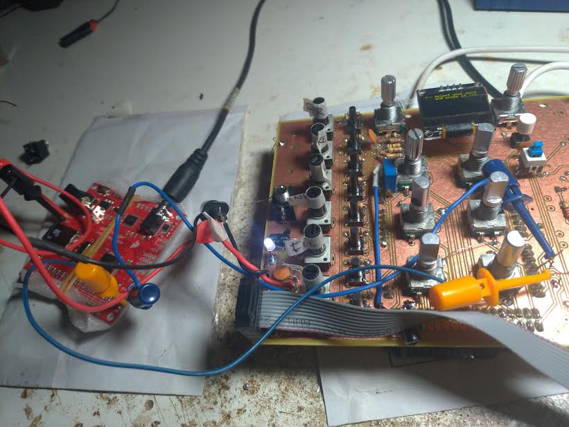
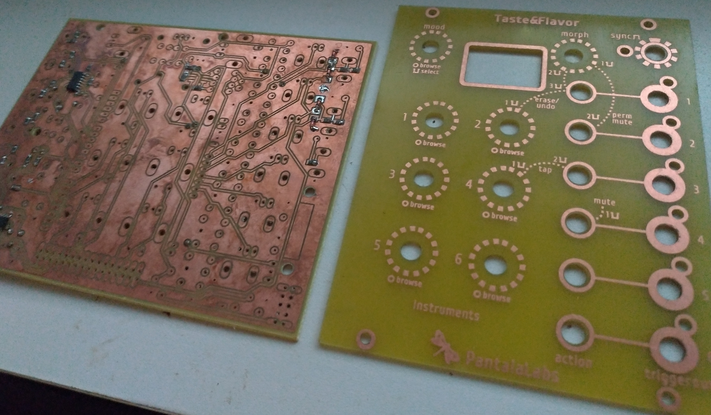
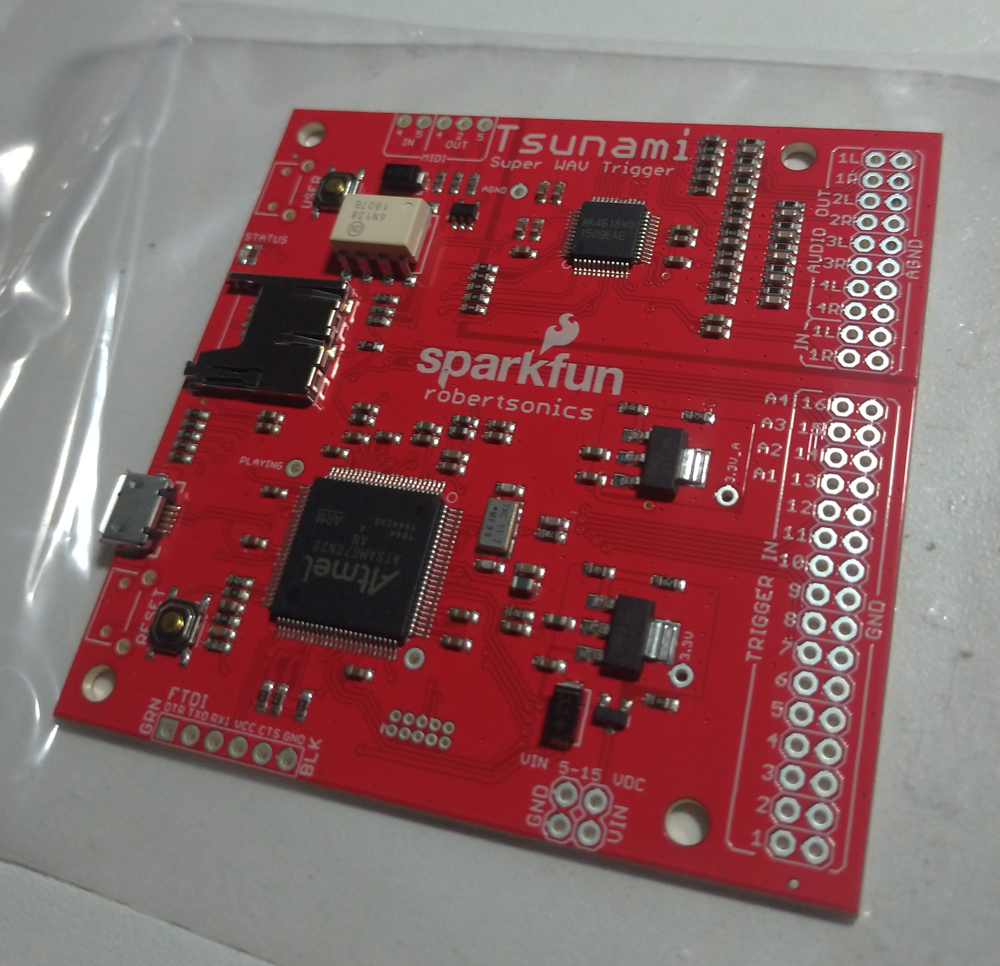

```
Task manager:
                                             PCB         CODE     PANEL
pattern reset clock in                        o           X         o
clock select                                  o           x         o
distortion sub module                         x           -         x

- not applicable
x scheduled
o done
```

```
Contributing Music Producers (alphabetical order):
Carlos Pires - Cause Org Records (BRA)
Cheap Conductor - DetroitBR (BRA)
Edu M - DetroitBR (BRA)
Fabricio Peçanha - (BRA)

There are other CMPs who have also confirmed participation but asked 
to wait until they sent the full Mood or asked to contact them later.
```
UPDATES:

<li>11/05/2019<br>
  Decided to add an analog distortion/fuzz fx to the main module. So , new prototype will be made.

<li>11/02/2019<br>
  Yes !!! The Wavetrigger board works. So charming! <br>
  Goodbye rasberry pi and Pisound (great interface, but it wil be reserved to another project).<br>
  Made the logical/phisical integration with current PCB.<br>
  Made new panel too. Both were sent to manufacturer. <br>
  I hope this will gonna be the the final prototype!<br>
  
  Testing 1..2..3<br>
  </a><br>
  

<li>10/31/2019<br>
  The new proto is build and running<br>
  The cv sequencer was coded and it creates very nice melodies<br>
  The second WaveTrigger arrived.It will be tested this week<br>

<li>10/26/2019<br>
  Very good news. They arrived all together: <br>
  -The prototype version 0.2.;<br>
  -The panel version 0.1 - this is very important to evaluate measurements, colors, aesthetics and ergonomics.<br>
  -The tsunami wav trigger.<br>
  <li>This week I´ll work on new proto PCB. and next , the integration with Tsunami.<br>

</a><br>
</a><br>


<li>10/25/2019<br>
Maybe the new panel and PCB arrive today. <br>
Huge code improvement while creating Deck classes to deal with load/modify instruments samples and patterns.<br>

<li>10/21/2019<br>
Last friday I´ve turned on the module to make some speed tests with fast instrument change. Unhapilly I experiented a very loud glitch coming from Pure Data when it load the new selected instrument. Basically it makes a sudden stop before load the new instrument into memory. After some poking and coding , the solution was to increase from 6 channels to 12 independent channels. Yes , 12 channels working simultaneously. This solution allows each instrument to be played at any time without interrupting another instrument that should be played to its end. Now works like a breeze.<br>
This issue led me to decide to test other hardware solution too. Swap from RaspberryPi + Pisound to Sparkfun WavTrigger. I already finished the order , now wait arrival.<br>
The new panel and PCB wasn´t shipped to me yet. So, I can´t record the new video this week as expected.<br>

10/12/2019:<br>
<li>new panel with function buttons to make tweaking easier, USB input and some graphic changes;
<li>new schaematic and pcb;
<li>new prototype pcb ordered;
</a>

10/08/2019:
New panel with the 6 knob CV sequencer to integrated with the main step sequencer,
</a>


Taste & Flavor is an Eurorack module consisting of a step sequencer coupled to a multiple sample player and a track mixer that aims to fill a major gap in live performances with modular synthesizers allowing you to create a new mood with every percussion change. 

This mood transition is part of a concept I created called Mood Oriented Instruments. These instruments, in our case the module, must have the ability not only to reproduce sounds on demand, presets, but also, through algorithms, to add some level of intelligence to the final sound composition.

The module has an easy to understand interface with few buttons / controls ensuring its easy use, creative and especially with extremely fluid dynamics for sound transitions inspired by the possibilities available in a DJ Set. Why the DJ Set? Because the DJ Set allows infinite flexibility in choosing the next song.

Follows a sadly low quality video recorded for Instagram.

https://www.youtube.com/watch?v=SSSQcJ3n3aM

A photo of the prototype display (which has already changed)

https://www.instagram.com/p/B27kMMmh_lR/?hl=en

•Module:
It basically operates with 6 sample tracks triggered by a predefined pattern. (see Annex II)

Allows samples and patterns from each individual track to be exchanged for samples and patterns from other MOODs.

Allows you to edit each pattern using the Tap on each track.

Allows you to Undo the Tap sequence if you miss some step.

And finally, Morph's manual command that transitions track by track from one Mood to another. This is the biggest feature that guarantees the idea of "fluid dynamics."

Hardware and software: Arduino, RaspberryPi, Pisound, PureData


<a rel="license" href="http://creativecommons.org/licenses/by-sa/4.0/">
</a>
<br /><span xmlns:dct="http://purl.org/dc/terms/" property="dct:title">Taste&Flavor</span> by Gibran Curtiss Salomão from 
<a xmlns:cc="http://creativecommons.org/ns#" href="https://facebook.com/pantalalabs/" property="cc:attributionName" 
rel="cc:attributionURL">Pantala Labs</a> is licensed under a <a rel="license" href="http://creativecommons.org/licenses/by-sa/4.0/">
Creative Commons Attribution-ShareAlike 4.0 International License</a>.
